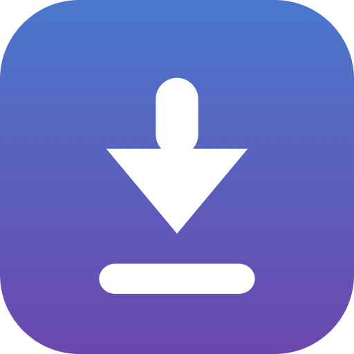

<div align="center">



# Video Downloader

**A native macOS app to download video (or just the audio) from almost any site.**
Paste a URL, pick a format, download it — a clean SwiftUI front-end over
[`yt-dlp`](https://github.com/yt-dlp/yt-dlp) + [`ffmpeg`](https://ffmpeg.org/).

[](https://github.com/GitBakko/video-downloader/actions/workflows/ci.yml)
[](https://github.com/GitBakko/video-downloader/releases/latest)
[](https://www.apple.com/macos/)
[](https://www.swift.org)
[](LICENSE)

</div>

---

## What it is

Video Downloader is a small, focused **macOS 14+** app for personal use. It wraps the
excellent open-source tools `yt-dlp` and `ffmpeg` in a native, curated GUI so you don't
have to touch a terminal:

- Paste **one or more URLs** (or a whole playlist).
- Choose a **format** — simple presets (Video / Audio + quality) or the full format table.
- Download to a folder, with live progress, a completion notification, and *Show in Finder*.

It supports the **~1800 sites** `yt-dlp` knows about — YouTube, Vimeo, TikTok, Instagram,
Twitch, Reddit, SoundCloud, and many more.

## Features

- 🎯 **Paste-and-go** — add several links at once or a whole playlist.
- 🎛️ **Hybrid format picker** — friendly presets by default, an expandable table of every
  available format for precise control; audio-only extraction to MP3.
- ⏬ **Managed download queue** — configurable parallelism (overall *and* per-site),
  pause/resume, per-item cancel/retry; a failed download never stalls the queue.
- 📋 **Clipboard capture** — copy a link while the app is running and it's proposed
  automatically (or auto-started, if you enable that). It only reacts to links copied
  *after* launch, never to whatever was already on the clipboard.
- 🕘 **Download history** — a persistent, searchable log of completed downloads, with
  filters (source, title, date ranges) and one-click *re-queue*.
- 🔔 **Notifications & sound** on completion, with *Show in Finder*.
- 🧰 **Self-managing binaries** — on first launch it downloads an architecture-matched
  `yt-dlp` + static `ffmpeg`/`ffprobe` into
  `~/Library/Application Support/VideoDownloader/bin`, and can update `yt-dlp` on demand.
- 🆕 **In-app release notes** — a *Novità* window renders the changelog by version.
- ♿ **Native & accessible** — real `List`-based UI, toolbar, VoiceOver labels.

## Requirements

- **macOS 14 (Sonoma) or newer**, Apple Silicon or Intel.
- An internet connection on first launch (to fetch `yt-dlp` + `ffmpeg`; ~a few seconds).
- Nothing else — the tools are downloaded and managed by the app.

## Install

### Option A — download a build

Grab the latest `Video Downloader.app` from the
[**Releases**](https://github.com/GitBakko/video-downloader/releases/latest) page.

> The app is **ad-hoc signed** (no Apple Developer account / notarization), so Gatekeeper
> will warn on first open. Either **right-click → Open** the first time, or clear the
> quarantine flag:
>
> ```bash
> xattr -dr com.apple.quarantine "/Applications/Video Downloader.app"
> ```

### Option B — build from source

```bash
# Prerequisites: Xcode 15+ and XcodeGen
brew install xcodegen

git clone https://github.com/GitBakko/video-downloader.git
cd video-downloader/App
xcodegen generate          # regenerate the Xcode project from project.yml
open VideoDownloader.xcodeproj   # then press ⌘R
```

## Usage

1. **Add** — paste one or more URLs (one per line) and press *Aggiungi*.
2. **Pick a format** — expand *Formato* on a row for presets or the full table.
3. **Download** — *Scarica* on a row, or *Scarica tutti*. Files land in
   `~/Movies/VideoDownloader` by default (configurable in Settings).
4. **Manage** — pause/resume the queue, cancel/retry an item, remove finished items,
   or browse *Cronologia* (history) to re-queue anything.

Settings let you choose the destination folder, default format, whether to embed
thumbnail/metadata, auto-start behaviour, and how many downloads run at once
(overall and per site).

## How it works

Under the hood the app shells out to `yt-dlp` for extraction/download and `ffmpeg` for
muxing/transcoding. It doesn't bundle them: on first launch it downloads an
architecture-matched, static build of each, unquarantines and ad-hoc-signs them so
Gatekeeper lets them run, and keeps them in Application Support. A JavaScript runtime
(deno/node/bun, if installed) is used for YouTube's web client extraction.

## Architecture

Two build units keep the logic testable and the UI thin:

| Unit | Path | What it holds |
| --- | --- | --- |
| **`VideoDownloaderCore`** | [`Sources/VideoDownloaderCore/`](Sources/VideoDownloaderCore) | A dependency-free SwiftPM library: models, `yt-dlp` JSON parsing, argument building, progress parsing, binary management, the download engine, the queue state machine, settings, history, and the changelog parser. **Fully unit-tested** (119 XCTest cases). |
| **App shell** | [`App/`](App) | A thin SwiftUI layer. The Xcode project is generated by [XcodeGen](https://github.com/yonaskolb/XcodeGen) from [`App/project.yml`](App/project.yml). |

Design & implementation docs live in
[`docs/superpowers/`](docs/superpowers).

## Development

```bash
# Library — the fast TDD loop, no GUI needed
swift test        # 119 tests
swift build

# App — regenerate and build the macOS target
cd App && xcodegen generate
xcodebuild -project App/VideoDownloader.xcodeproj -scheme VideoDownloader \
  -configuration Debug -destination 'platform=macOS' build   # ** BUILD SUCCEEDED **
```

Both gates — `swift test` green **and** `xcodebuild` **BUILD SUCCEEDED** — must stay green
for every change. See [`CONTRIBUTING.md`](CONTRIBUTING.md).

## Versioning & changelog

The project follows [Semantic Versioning](https://semver.org) and
[Keep a Changelog](https://keepachangelog.com). Every change is recorded in
[`CHANGELOG.md`](CHANGELOG.md) (also visible in-app via *Novità*). Releases are cut with
[`scripts/release.sh`](scripts/release.sh); the full policy is in
[`docs/VERSIONING.md`](docs/VERSIONING.md).

## Out of scope

Subtitles, login/cookies for private content, editing/trim, notarized distribution,
queue persistence across launches, and Windows/Linux are intentionally out of scope.

## Acknowledgements

Built on the shoulders of giants:

- [**yt-dlp**](https://github.com/yt-dlp/yt-dlp) — the extraction/download engine.
- [**ffmpeg**](https://ffmpeg.org/) (static builds via
  [eugeneware/ffmpeg-static](https://github.com/eugeneware/ffmpeg-static)) — muxing/transcoding.
- [**XcodeGen**](https://github.com/yonaskolb/XcodeGen) — project generation.

## Disclaimer

This is a personal-use tool. Please respect the terms of service of the sites you use it
with, and only download content you have the right to. You are responsible for how you use it.

## License

[MIT](LICENSE) © 2026 [GitBakko](https://github.com/GitBakko)
